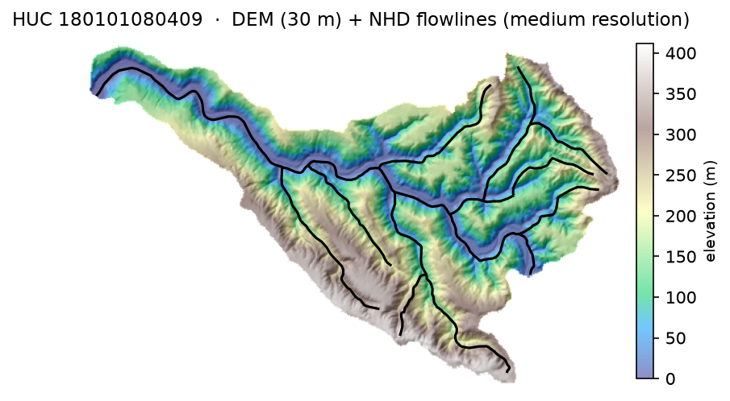

# headwaters

Fetch source data for a watershed from USGS services: the boundary, DEM, and
NHD flowlines for a given HUC ID. Thin wrapper around the HyRiver stack
(pygeohydro/pynhd/py3dep).

```python
from headwaters import fetch_huc

dem, flowlines = fetch_huc(
    "180101080409", nhd_layer="medium", dem_resolution=30, crs="EPSG:3310"
)
```



<sub>Flowlines whose upstream end sits on the watershed boundary are filtered
    out — they might be artifacts resulting from clipping to the watershed
    boundary </sub>

<sub>Regenerate: `uv run --group example python examples/plot.py`</sub>
